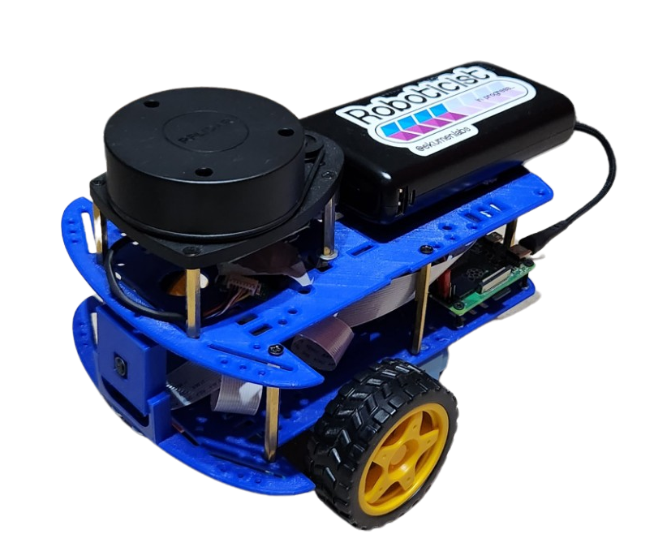
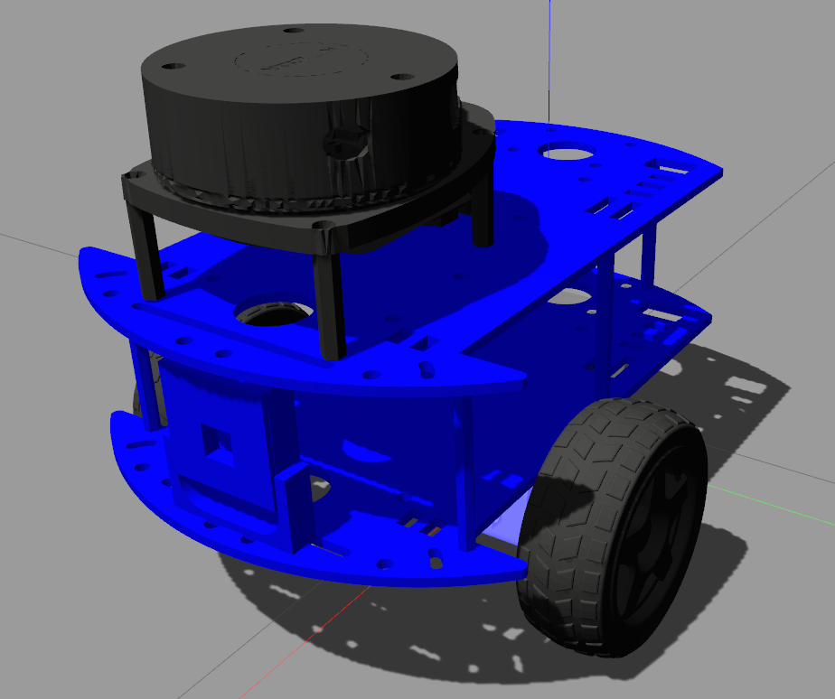

<div align="center">

  

</div>

<div align="center">

  

</div>

Andino is a fully open-source diff drive robot designed for educational purposes and low-cost applications.
It is fully integrated with ROS 2 and it is a great base platform to improve skills over the robotics field.
With its open-source design, anyone can modify and customize the robot to suit their specific needs.

<p align="center">
  
</p>

_Note: For videos go to [Media](#selfie-media) section._

## :books: Package Summary

- :rocket: [`andino_bringup`](./andino_bringup): Contains mainly launch files in order to launch all related driver and nodes to be used in the real robot.
- :robot: [`andino_hardware`](./andino_hardware): Contains information about the Andino assembly and hardware parts.
- :ledger: [`andino_description`](./andino_description): Contains the URDF description of the robot.
- :hammer_and_pick: [`andino_firmware`](./andino_firmware): Contains the code be run in the microcontroller for interfacing low level hardware with the SBC.
- :gear: [`andino_base`](./andino_base): [ROS Control hardware interface](https://control.ros.org/master/doc/ros2_control/hardware_interface/doc/writing_new_hardware_interface.html) is implemented.
- :control_knobs: [`andino_control`](./andino_control/): It launches the [`controller_manager`](https://control.ros.org/humble/doc/ros2_control/controller_manager/doc/userdoc.html) along with the [ros2 controllers](https://control.ros.org/master/doc/ros2_controllers/doc/controllers_index.html): [diff_drive_controller](https://control.ros.org/master/doc/ros2_controllers/diff_drive_controller/doc/userdoc.html) and the [joint_state_broadcaster](https://control.ros.org/master/doc/ros2_controllers/joint_state_broadcaster/doc/userdoc.html).
- :computer: [`andino_gz_classic`](./andino_gz_classic/): Gazebo simulation of the `andino` robot.
- :world_map: [`andino_slam`](./andino_slam/): Provides support for SLAM with your `andino` robot.
- :compass: [`andino_navigation`](./andino_navigation/): Navigation stack based on `nav2`.

## :paperclips: Related projects

Other projects built upon Andino! :rocket:

- :test_tube: [`andino_integration_tests`](https://github.com/Ekumen-OS/andino_integration_tests): Extension to the Andino robot showing how to build integration tests.
- :lady_beetle: [`andino_webots`](https://github.com/Ekumen-OS/andino_webots): [Webots](https://github.com/cyberbotics/webots) simulation of the Andino robot fully integrated with ROS 2.

## :pick: Robot Assembly

Visit [`andino_hardware`](./andino_hardware/) for assembly instructions.

## :mechanical_arm: Installation

### Platforms

- ROS 2: Humble Hawksbill
- OS:
  - Ubuntu 22.04 Jammy Jellyfish
  - Ubuntu Mate 22.04 (On real robot (e.g: Raspberry Pi 4B))

### Build from Source

#### Dependencies

1. Install [ROS 2](https://docs.ros.org/en/humble/Installation/Ubuntu-Install-Debians.html)
2. Install [colcon](https://colcon.readthedocs.io/en/released/user/installation.html)

#### colcon workspace

Packages here provided are colcon packages. As such a colcon workspace is expected:

1. Create colcon workspace

```
mkdir -p ~/ws/src
```

2. Clone this repository in the `src` folder

```
cd ~/ws/src
```

```
git clone https://github.com/Ekumen-OS/andino.git
```

3. Install dependencies via `rosdep`

```
cd ~/ws
```

```
rosdep install --from-paths src --ignore-src -i -y
```

4. Build the packages

```
colcon build
```

5. Finally, source the built packages
   If using `bash`:

```
source install/setup.bash
```

`Note`: Whether your are installing the packages in your dev machine or in your robot the procedure is the same.

## :rocket: Usage

### Robot bringup

`andino_bringup` contains launch files that concentrates the process that brings up the robot.

After installing and sourcing the andino's packages simply run.

```
ros2 launch andino_bringup andino_robot.launch.py
```

This launch files initializes the differential drive controller and brings ups the system to interface with ROS.
By default sensors like the camera and the lidar are initialized. This can be disabled via arguments and manage each initialization separately. See `ros2 launch andino_bringup andino_robot.launch.py -s ` for checking out the arguments.

- include_rplidar: `true` as default.
- include_camera: `true` as default.

After the robot is launched, use `ROS 2 CLI` for inspecting environment. E.g: By doing `ros2 topic list` the available topics can be displayed.

### Teleoperation

Launch files for using the keyboard or a joystick for teleoperating the robot are provided.

[`twist_mux`](http://wiki.ros.org/twist_mux) is used to at the same time accept command velocities from different topics using certain priority for each one of them (See [twist_mux config](andino_bringup/config/twist_mux.yaml)). Available topics are (ordering by priority):

- cmd_vel
- cmd_vel_keyboard
- cmd_vel_joy

### RViz

Use:

```
ros2 launch andino_bringup rviz.launch.py
```

For starting `rviz2` visualization with a provided configuration.

## :computer: Simulation

The [`andino_gz_classic`](./andino_gz_classic/README.MD) package provides a Gazebo simulation fo the Andino robot.



## :compass: Navigation

The [`andino_navigation`](./andino_navigation/README.md) package provides a navigation stack based on the great [Nav2](https://github.com/ros-planning/navigation2) package.

https://github.com/Ekumen-OS/andino/assets/53065142/29951e74-e604-4a6e-80fc-421c0c6d8fee

_Important!: At the moment this package is only working with the simulation. The support for the real robot is forthcoming._


## :selfie: Media

### RVIZ Visualization

https://github.com/Ekumen-OS/andino/assets/53065142/c9878894-1785-4b81-b1ce-80e07a27effd

### Slam

Using the robot for mapping.

https://github.com/Ekumen-OS/andino/assets/53065142/d73f6053-b422-4334-8f62-029a38799e66

https://github.com/Ekumen-OS/andino/assets/53065142/133a4587-f384-4420-a843-15062ddb3e35


See [`andino_slam`](./andino_slam/) for more information.

## :robot: Share your Andino!

Have you built your `Andino` already? Please go to [`Show & Tell`](https://github.com/Ekumen-OS/andino/discussions/categories/show-and-tell) Discussion and share with us your own version of it.


## :star2: Inspirational sources

This section is dedicated to recognizing and expressing gratitude to the open-source repositories that have served as a source of inspiration for this project. We highly recommend exploring these repositories for further inspiration and learning.

 * [articubot_one](https://github.com/joshnewans/articubot_one)
 * [diffbot](https://github.com/ros-mobile-robots/diffbot)
 * [noah_hardware](https://github.com/GonzaCerv/noah-hardware)
 * [linorobot](https://github.com/linorobot/linorobot2)

## :raised_hands: Contributing

Issues or PRs are always welcome! Please refer to [CONTRIBUTING](CONTRIBUTING.md) doc. 

## Code development

Note that a [`Docker`](./docker) folder is provided for easy setting up the workspace.
