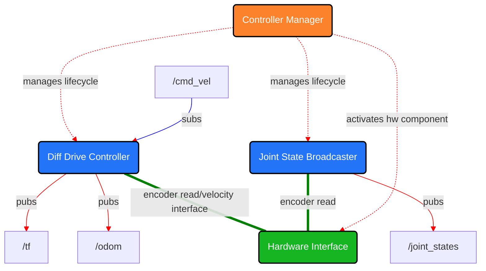

# andino_control

## Description

ROS 2 Control is being used for controlling the robot and to interface with ROS framework.

The following diagram describes several parts of the system that controls the robot via ROS 2 control tools.

### Hardware Interface

The hardware interface component for this robot is implemented by [`andino_base`](../andino_base/) package. It is in charge of providing the necessary state and command interfaces to be claimed by the controllers.

### Controller Manager

The [Controller Manager](https://control.ros.org/humble/doc/ros2_control/controller_manager/doc/userdoc.html#controller-manager) is in charge of managing the lifecycle of the controllers, access to the hardware interfaces and offers services to the ROS-world.

The hardware interface to be activated when `controller_manager` node is activated is indicated via robot description passed via ROS 2 Parameter. A tag `<ros2_control>` is expected to be present in the robot description with the information of the hardware components to be activated as well as the state and command interfaces. See [`andino_control.urdf.xacro`](../andino_description/urdf/include/andino_control.urdf.xacro).

### ROS 2 Controllers
Two controllers are being used from the available [ros2_controllers](https://control.ros.org/humble/doc/ros2_controllers/doc/controllers_index.html):
  - [diff_drive_controller](https://control.ros.org/humble/doc/ros2_controllers/diff_drive_controller/doc/userdoc.html): *Controller for mobile robots with differential drive. Input for control are robot body velocity commands which are translated to wheel commands for the differential drive base. Odometry is computed from hardware feedback and published.*
    - Used state interfaces:
      - left wheel velocity
      - right wheel velocity
      - left wheel position
      - right wheel position
    - Used command interfaces
      - left wheel velocity
      - right wheel velocity
  - [joint_state_broadcaster](https://control.ros.org/humble/doc/ros2_controllers/joint_state_broadcaster/doc/userdoc.html): The broadcaster reads all state interfaces and reports them on `/joint_states` and `/dynamic_joint_states`.
    - Used state interfaces:
      - left wheel position
      - right wheel position

Each controller accepts ROS 2 parameters which they are provided via [`andino_controllers.yaml`](config/andino_controllers.yaml). 
