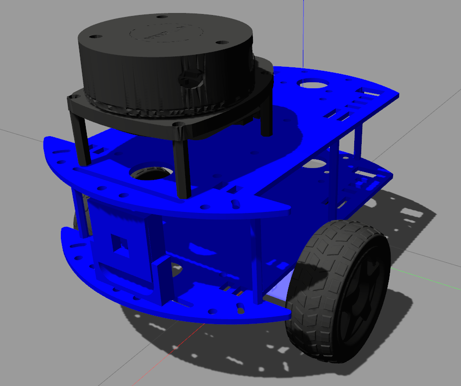

# Gazebo Classic simulation for the Andino robot



## Build

Install package dependencies:

```
rosdep install --from-paths src -i -y
```

Build the package:

```
colcon build
```

Note: `--symlink-install` can be added if needed.

Finally, source the install folder
```
. install/setup.bash
```

Note: `gazebo` might be needed to be sourced as well

```
. /usr/share/gazebo/setup.bash
```

# Usage 

This package has the next option to be executed.

## Andino simulation with Gazebo diff drive plugin


```
ros2 launch andino_gz_classic andino_one_robot.launch.py initial_pose_x:=3.0
```

This launch file supports the following launch arguments:

- `use_sim_time` . This parameter indicate to the rviz that it should work with simulation time. (default: 'true')
- `rviz` . This parameter let to decide if you want to run rviz with this launch. False can be useful if you want to view the rviz in another computer. (default: 'true')
- `world` . SDF file of the world where andino will run. Note that the world should be available in gazebo paths.(default: 'empty_world.world')

Finally, all the parameters of spawn an andino robot to put the robot in specific position are available. for more information of all the parameters of the child launch files you can write:

```
ros2 launch andino_gz_classic andino_one_robot.launch.py -s
```
## Andino simulation with Gazebo ros2 control plugin

```
ros2 launch andino_gz_classic andino_one_robot.launch.py use_gazebo_ros_control:=true
```

### Considerations
- note that the twist topic is `diff_controller/cmd_vel_unstamped`.
- The twist topic should be sent at a frequency of at least $10hz$ because the action has a validity timeout.

## Spawn an Andino robot

```
ros2 launch andino_gz_classic spawn_robot.launch.py initial_pose_x:=3.0 entity:=andino robot_description_topic:=/andino/robot_description
```

The parameters of this launch let to put the robot in any place of the simulation.

- `use_sim_time`: Use simulation (Gazebo) clock if true. (default: 'true')

- `initial_pose_x`: Initial x pose of andino in the simulation. (default: '0.0')

- `initial_pose_y`: Initial y pose of andino in the simulation. (default: '0.0')

- `initial_pose_z`: Initial z pose of andino in the simulation. (default: '0.0')

- `robot_description_topic`: robot description topic. (default: '/robot_description')

- `initial_pose_yaw`: Initial yaw pose of andino in the simulation. (default: '0.0')

- `use_gazebo_ros_control`: True to use the gazebo_ros_control plugin.  (default: 'false')

- `entity`: Name of the robot. (default: 'andino')

- `rsp_frequency`: robot state publisher frequency. (default: '30.0')

Spawn multiple andino robots has some issues, so no namespace is created.
