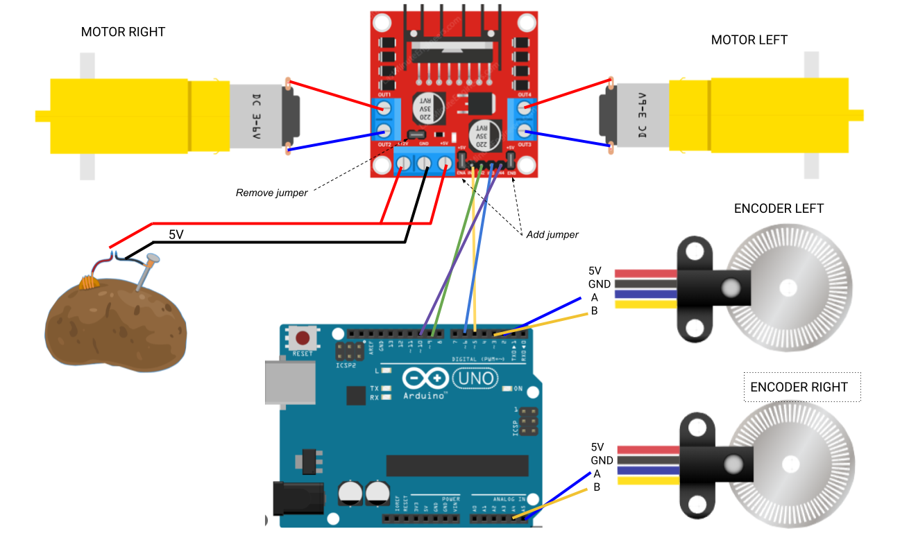

# carpincho_hardware

This package aims to provide the necessary information to the correct assembly of the robot.

## Bill of Materials

| Module | Part                    | Variant | Comments |
|:--|:------------------------|:---------------------|:-------------------------------------------------------:|
| SBC | Raspberry Pi 4 B (4 Gb) | - | - |
| Chassis |  2 x [Print 3d Chassis](./printing_model/chassis/) + [Wheels](https://www.sparkfun.com/products/13259) | [Robot Smart Car Kit](https://www.amazon.com/perseids-Chassis-Encoder-Wheels-Battery/dp/B07DNYQ3PX/ref=sr_1_1?crid=9WUXNUN54JBG&keywords=Smart%2BCar%2BChassis%2BKit&qid=1685739917&sprefix=smart%2Bcar%2Bchassis%2Bkit%2Caps%2C348&sr=8-1&th=1) | - | 
| Motors | 2 x [Hobby Motor with Encoder - Metal Gear (DG01D-E)](https://www.sparkfun.com/products/16413) |  [Robot Smart Car Kit](https://www.amazon.com/perseids-Chassis-Encoder-Wheels-Battery/dp/B07DNYQ3PX/ref=sr_1_1?crid=9WUXNUN54JBG&keywords=Smart%2BCar%2BChassis%2BKit&qid=1685739917&sprefix=smart%2Bcar%2Bchassis%2Bkit%2Caps%2C348&sr=8-1&th=1)'s motors + sensor hall encoder | Embbebed encoders are recommended for better accuracy |
| Microcontroller | Arduino Nano | Arduino Uno | Nano is easier to mount given its size | 
| Motor Driver | [L298N Dual H Bridge](https://www.amazon.com/Bridge-Stepper-Driver-Module-Controller/dp/B09T6K9RFZ/ref=sr_1_4?crid=37YY7JO6C3WVE&keywords=l298&qid=1685740618&sprefix=l29%2Caps%2C277&sr=8-4) | - | - |
| Laser Scanner | [RPLidar A1M8](https://www.robotshop.com/products/rplidar-a1m8-360-degree-laser-scanner-development-kit?_pos=3&_sid=b0aefcea1&_ss=r) | [RPLidar A2M8](https://www.robotshop.com/products/rplidar-a2m8-360-laser-scanner) | - |
| Camera | [Raspi Camera Module V2, 8 MP](https://www.robotshop.com/products/raspberry-pi-camera-module-v2) | - | - |
| Powerbank 5V | - | - | Any powerbank is suitable: Mind size / weight / output current(>=2A) |
| (Optional) Power Step up | [DC - DC boost converter](https://www.amazon.com/0-9-Step-Regulator-DC-Converter/dp/B0C6QTJMFN/ref=sr_1_25?crid=G0FHM4SS5TWX&keywords=dc+step+up+converter&qid=1685741155&sprefix=dc+step+up+conver%2Caps%2C371&sr=8-25) | - | If motors support higher voltage than 5V a step-up(e.g: to 9V) can be added between powerbank(5V) and motor driver |
| Fixing & Mount | M3 bolts/fasteners - M3 Spacers - M2.5/2.0 bolts/fasteners for SBC | - | - |


## Connection Diagram

### Motor-Arduino



Some frequent errors:
 - If one of the motors rotates in the opposite direction (think about the orientation of the motors in the chassis) probably the output(+ and -) of the L298N's output should be toggled.
 - When moving forward the encoder values should increase while moving backwards they should decrease. If it is happening the other way around probably the A and B encoder signals should be toggled.


## Microcontroller Configuration

For uploading the microcontroller firmware please refer to [`carpincho_firmware`](../carpincho_firmware/README.md) package.

## Single Board Computer (SBC)

The SBC used in this project is a Raspberry Pi 4b so the guidelines here will refer particularly to this family of on-board computers, however extending its use to other families is possible as well.

### Operative System

Ubuntu Mate 22.04 ARM64 is the recommended operative system for this project. This OS provides good capabilities for a educational platform as well as good performance.

For installing this OS in the Raspberry:
1. Download the image from here: [ubuntu mate download]()https://ubuntu-mate.org/download/arm64/


2. Install OS to a microSD card using [Raspberry Pi Imager](https://www.raspberrypi.com/software/).
   - No extra configuration should be necessary.

3. Boot your raspberry using the microSD and a HDMI connection. Some initial configuration is necessary. Follow the wizard for a proper set up. It is recommended to use simple User and Password combinations for the user. For example:
    - user: pi
    - password: admin

4. Once is done, run `sudo apt update && sudo apt upgrade` in a terminal for updating the system. Then reboot.

### Installing dependencies

Some packages are necessary to be installed towards a correct set up of the robot's on-board computer.

#### ssh-server

In general, you will want to access to the Raspberry remotely via `ssh` connection while being connected in the same network.
So we need to install `ssh-server`;
```
sudo apt-get install openssh-server
```
Enable it if it is not enabled yet:
```
sudo systemctl enable ssh --now
```

After this you will be able to access this device from a remote computer by doing:
```
ssh <user>@<ip>
```
For example if the user is `pi` and the ip is `192.168.0.102`
```
ssh pi@192.168.0.102
```


#### Common utilities

Install some common utilities that will be required later on.

```
sudo apt update
```

```
sudo apt install git net-tools software-properties-common build-essential -y
```
```
sudo apt install python3-rosdep2 python3-catkin-pkg python3-catkin-pkg-modules python3-rospkg-modules python3-rospkg  -y
```

#### Install ROS

Follow suit the instructions for installing next dependencies from binaries:
 - [ROS 2 Humble](https://docs.ros.org/en/humble/Installation/Ubuntu-Install-Debians.html)
 - [Colcon](https://colcon.readthedocs.io/en/released/user/installation.html)

To automatically source ROS installation, it is recommended to add `source /opt/ros/humble/setup.bash` line to the `~/.bashrc` file.

#### Arduino

Arduino drivers are necessary for the SBC (Raspberry) <--> Microcontroller(Arduino) serial communication.

```
sudo apt install arduino
```

Configure it properly:
1. Add user to `dialout` and `plugdev` groups:
   ```
   sudo usermod -a -G dialout $USER
   ```
   ```
   sudo usermod -a -G plugdev $USER
   ```
   Note you will need a reboot after this to be effective.
2. Remove `brltty` from the system
   ```
   sudo apt remove brltty
   ```
   In Ubuntu 22.04 seems to be an issue with some chip drivers and the `brltty` daemon. To avoid this conflict we remove `brltty` as suggested. See [this stackoverflow post](https://stackoverflow.com/questions/70123431/why-would-ch341-uart-is-disconnected-from-ttyusb) for further information.


#### Raspberry Camera Module V2

After connecting the camera module to the Raspberry's camera port.
```
sudo apt install libraspberrypi-bin v4l-utils
```
```
sudo usermod -aG video $USER
```

Check camera status:
```
vcgencmd get_camera
```


#### RPLidar installation

The installation of the A1M8 RPLidar sensor is quite straight forward and a ros integration package will be installed later on via `rosdep`.

For now, after connecting it to the usb port:
 1. Verify USB connection: Green light in the usb conversor(A1M8 side board) should be turned on.
 2. Check the authority of RPLidar's serial-port:
    - `ls -l /dev |grep ttyUSB`
    - Add extra bits by doing `sudo chmod 666 /dev/ttyUSB<number_of_device>`

### Create robot workspace

Let's create our workspace and build from source this repository.

```
cd ~
```
```
mkdir robot_ws/src -p
```
Clone this repository in the `src` folder
```
cd robot_ws/src
```
```
git clone <repository_address>
```
Install dependencies via rosdep:
```
cd ~/robot_ws
```
```
rosdep install --from-paths src -i -y
```
Let's build the packages.
```
colcon build
```
After building is completed:
```
source install/setup.bash
```

After this, you are good to go and use the robot!
Refer to [`usage`](../README.md#usage) section.

### Extra Recommendations & Tools

#### Network
Via terminal the wifi connection can be switched by doing:

List available wifi networks: 
```
sudo nmcli dev wifi list
```
Connect to the desired one:
```
sudo nmcli --ask dev wifi connect <SSID>
```

#### Copy files remotely

Using `scp` is a useful tool when copying files remotely over `ssh`.

For copying a folder from host to remote unit:
```
scp -r <path/to/folder> <remote_user>@<remote_ip>:<remote_path_to_folder>
```

#### ROS Domain ID

The domain ID is used by DDS to compute the UDP ports that will be used for discovery and communication.

When using a "public" network using the domain id is a good technique to avoid extra noise with other ROS 2 system in the same network.

See [ROS_DOMAIN_ID](https://docs.ros.org/en/humble/Concepts/Intermediate/About-Domain-ID.html)

TLDR? Export an environment variable with the same ID in **all** ROS 2 clients in the network for a correct discovery.
```
export ROS_DOMAIN_ID=<a_number_between_0_and_101>
```
