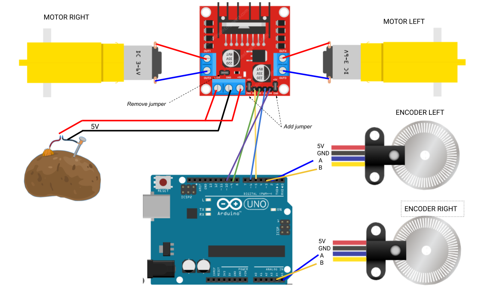

# carpincho_hardware

This package aims to provide the necessary information to the correct assembly of the robot.

## Bill of Materials

| Module | Part                    | Variant | Comments |
|:--|:------------------------|:---------------------|:-------------------------------------------------------:|
| SBC | Raspberry Pi 4 B (4 Gb) | - | - |
| Chassis |  2 x [Print 3d Chassis](./printing_model/chassis/) + [Wheels](https://www.sparkfun.com/products/13259) | [Robot Smart Car Kit](https://www.amazon.com/perseids-Chassis-Encoder-Wheels-Battery/dp/B07DNYQ3PX/ref=sr_1_1?crid=9WUXNUN54JBG&keywords=Smart%2BCar%2BChassis%2BKit&qid=1685739917&sprefix=smart%2Bcar%2Bchassis%2Bkit%2Caps%2C348&sr=8-1&th=1) | - | 
| Motors | 2 x [Hobby Motor with Encoder - Metal Gear (DG01D-E)](https://www.sparkfun.com/products/16413) |  [Robot Smart Car Kit](https://www.amazon.com/perseids-Chassis-Encoder-Wheels-Battery/dp/B07DNYQ3PX/ref=sr_1_1?crid=9WUXNUN54JBG&keywords=Smart%2BCar%2BChassis%2BKit&qid=1685739917&sprefix=smart%2Bcar%2Bchassis%2Bkit%2Caps%2C348&sr=8-1&th=1)'s motors + sensor hall encoder | Embbebed encoders are recommended for better accuracy |
| Microcontroller | Arduino Nano | Arduino Uno | Nano is easier to mount given its size | 
| Motor Driver | [L298N Dual H Bridge](https://www.amazon.com/Bridge-Stepper-Driver-Module-Controller/dp/B09T6K9RFZ/ref=sr_1_4?crid=37YY7JO6C3WVE&keywords=l298&qid=1685740618&sprefix=l29%2Caps%2C277&sr=8-4) | - | - |
| Laser Scanner | [RPLidar A1M8](https://www.robotshop.com/products/rplidar-a1m8-360-degree-laser-scanner-development-kit?_pos=3&_sid=b0aefcea1&_ss=r) | [RPLidar A2M8](https://www.robotshop.com/products/rplidar-a2m8-360-laser-scanner) | - |
| Camera | [Raspi Camera Module V2, 8 MP](https://www.robotshop.com/products/raspberry-pi-camera-module-v2) | - | - |
| Powerbank 5V | - | - | Any powerbank is suitable: Mind size / weight / output current(>=2A) |
| (Optional) Power Step up | [DC - DC boost converter](https://www.amazon.com/0-9-Step-Regulator-DC-Converter/dp/B0C6QTJMFN/ref=sr_1_25?crid=G0FHM4SS5TWX&keywords=dc+step+up+converter&qid=1685741155&sprefix=dc+step+up+conver%2Caps%2C371&sr=8-25) | - | If motors support higher voltage than 5V a step-up(e.g: to 9V) can be added between powerbank(5V) and motor driver |
| Fixing & Mount | M3 bolts/fasteners - M3 Spacers - M2.5/2.0 bolts/fasteners for SBC | - | - |

## Connection Diagram

### Motor-Arduino

Some frequent errors:
 - If one of the motors rotates in the opposite direction (think about the orientation of the motors in the chassis) probably the output(+ and -) of the L298N's output should be toggled.
 - When moving forward the encoder values should increase while moving backwards they should decrease. If it is happening the other way around probably the A and B encoder signals should be toggled.

## Microcontroller Set up

TODO

## Single Board Computer (SBC) Set up

TODO
